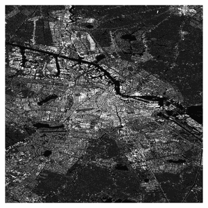

# DePSI: Delft PS-InSAR processing package

<div style="text-align: center;">
  
</div>

DePSI (van Leijen, 2014) is an open source Python software package for Persistent Scatterer Interferometric SAR (PS-InSAR) processing. It provides a comprehensive suite of functions to identify Persistent Scatterer (PS) points from a time series of interferometric SAR data, and estimate their deformation time series based on customizable assumptions, such as a predefined deformation model.

DePSI was originally implemented in MATLAB in 2014. The Python implementation of DePSI is motivated by acconmondating the classic DePSI algorithm into a modern software framework, enabling easier maintenance and contribution from the InSAR community. The Python version also enables the support of parallel computing and handling large datasets by leveraging `Dask` and `Xarray` libraries.

For the original MATLAB version, which is static without further development, please refer to the [MATLAB branch](https://github.com/TUDelftGeodesy/DePSI/tree/stable) of this repository.

## Installation

You can install DePSI from the Python Package Index (PyPI) using `pip`:

```sh
pip install depsi
```

Please refer to the [Installation Guide](installation.md) for more details.

## User Guide

The [User Guide](usages/depsi_workflow.md) provides comprehensive instructions and examples on how to use DePSI for PS-InSAR processing.

## API Reference

The [API Reference](api/classification.md) documents all available classes and functions in DePSI.

## Developer Guide

Awesome! If you are contributing to DePSI, please refer to the [Developer Guide](dev_guide.md) for installation instructions, testing, and other development-related information.

## References

[1] Van Leijen, Frederik Johannes. "Persistent scatterer interferometry based on geodetic estimation theory." (2014).