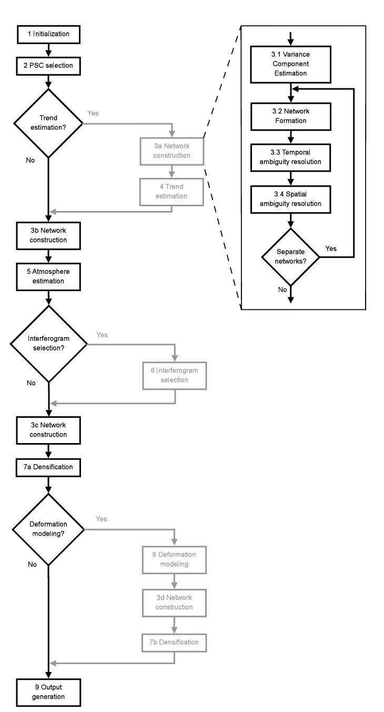

# DePSI Workflow

  
  
<em>DePSI workflow (Van Leijen, 2014)</em>

The current Python implementation DePSI can perform the following main steps:

1. **PS candidate selection**: Identify candidate PS points based on customizable criteria, such as Normalized Amplitude Dispersion, etc.
2. **Network generation**: Construct a spatial network of high-quality PS candidates based on their spatial distribution, estimate deformation deformation related parameters of the network arcs, then integrating the arc parameters to estimate the deformation parameters of PS points of the network.
3. **Atmospheric phase screen estimation**: Estimate atmospheric phase screen (APS) based on the residual phases of the network PS points.
4. **Densification**: Estimate all candidate PS points' deformation parameters by incorporating the APS and network arc parameters.
5. **Geo-coding**: Convert the estimated deformation parameters from radar coordinates to geographic coordinates.

This user guide provides examples and instructions on how to use DePSI to perform each of these steps. For a complete end-to-end example, please refer to the [DePSI full workflow demo notebook](../notebooks/demo_depsi_full.ipynb).